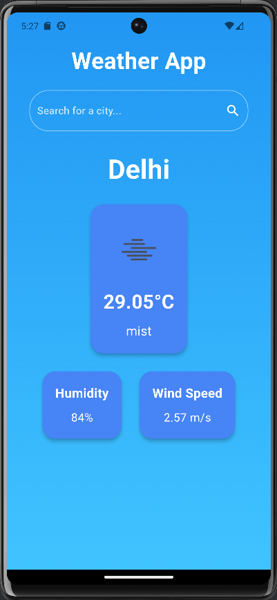
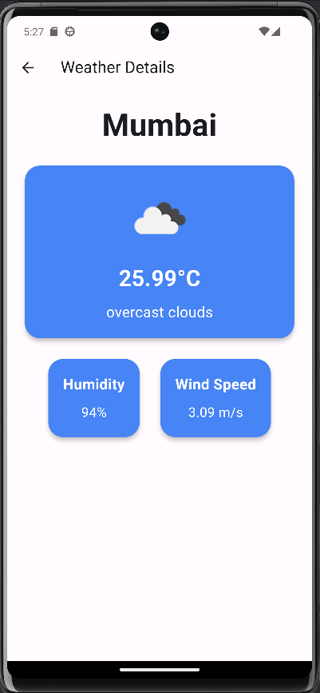
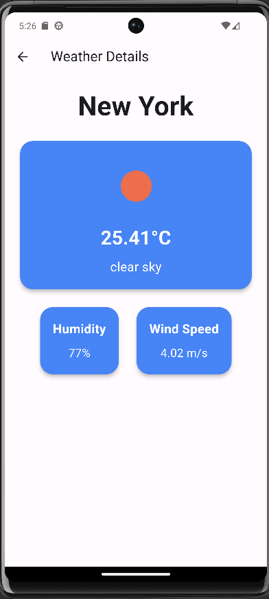

# Weather App

A beautiful and simple weather application built with Flutter, utilizing the OpenWeather API to provide current weather details. This app allows users to search for weather information in any city and view the details on a dedicated screen. It also includes a refresh functionality to update the weather data.

## Features

- **Search for Weather**: Users can search for any city to get current weather details.
- **Current Location Weather**: Displays the weather information of a default city (e.g., Delhi).
- **Pull to Refresh**: Easily refresh the data to get the latest weather information.
- **Beautiful UI**: Aesthetic and responsive user interface with weather icons and detailed weather cards.
- **Navigation**: Navigate between the home screen and the search results screen.

## Screenshots





## Installation

1. **Clone the repository**:
   ```bash
   git clone https://github.com/your-username/weather-app.git
   cd weather-app
